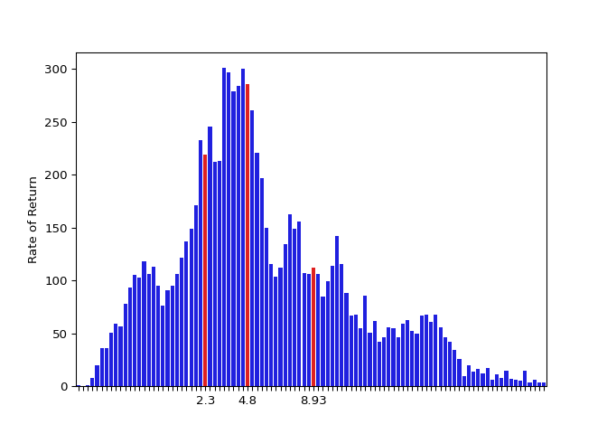

# Portfolio

### Introduction

“The average return on stocks is 6% per year.”

“Most of the gains in the market in any year come from the ten best
days.”

Do these claims sound familiar? I’ve heard these many times, and if
you’ve ever looked up or had an investment advisor give you advice,
they probably sound familiar to you too. If you hear these claims
somewhere like Ben Felix’s YouTube channel [Common Sense
Investing](https://www.youtube.com/channel/UCDXTQ8nWmx_EhZ2v-kp7QxA)
(CSI), you’ll even be told that these claims are backed up by peer
reviewed academic literature.

I’m still not convinced. In the case of claims made on CSI, I could just
look up the papers and verify the methods. But it occurred to me that as
someone with quantitative reasoning and coding skills, instead of merely
fact checking, I could instead draw on public market data to recreate
the analyses used derive those claims myself. That way, not only could I
verify the claims I’ve heard, but also test whether those claims (often
made about the US stock market) also apply to the Canadian market and
perhaps even my own hypotheses.

I also have another related quandary. It’s very difficult to compare the
performance between different portfolios. If you look up model
portfolios online, they’ll regularly list of the growth of $10k over the
past three months, six months, year, and five years. But what if you
want to compare your own portfolio which maybe you’ve had for 43 months
and for which you only know the rate of return for the first 41 months
or the last 22? What if in the time you’ve had a portfolio, you’ve made
multiple contributions or multiple withdrawals? What if at some point
you switched investment adviser? Then to really make an apples-to-apples
comparison, you should also consider whether the model portfolio you see
advertised has the same general asset allocation (same geographic
allocation, asset class allocation, etc).

So here are my goals for this project.

###### Main Goals

  - Verify claims about the stock (and bond) markets
  - Explore modern tools of data analysis
  - Explore concepts in statistics

###### Stretch Goal

  - Create a tool to make apples-to-apples comparisons in the
    performance of portfolios.

### Fine print

This project is very much a work in progress. In what follows, I ignore
inflation, investment fees, taxes, dividends and all other cash payouts
from holding assets.

Rates of return are based on the *Adj Close* values.

There’s also a few holes in my data set which I’ve filled in by taking
the average Adj Close values of the closest non-null values.

There are probably other errors in my work.

### Data Source

The data for this project comes from [Yahoo
Finance](ca.finance.yahoo.com).

### Claim \#1

“The average return on stocks is 6% per year.”

According to my calculations, the annualized average return on a five
year investment in the TSX made on any trading day from June 29, 1979 to
April 24, 2015 is 5.8%. Hey\! That’s pretty close\!

But how likely would you have gotten an annual rate of return of 5.8%
after five years, if you just happened to throw in a lump some
investment in the TSX on some trading day from June 29, 1979 to April
24, 2015? Let’s look at the distribution of 5-year annualized rates of
return in that time period.

<!-- -->   Note: in
the histogram above, 0 indicates no growth after 5 years. The 25th, 50th
(median), and 75th quantiles are highlighted in red.

As can be gleaned from the histogram above, the average return is
actually higher than what most people would get, assuming they invested
on a random day. In fact, it’s more than 59.46% of investors would get.

To be continued…
